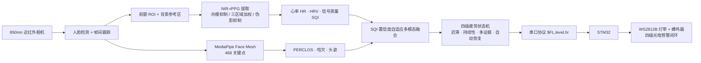

# 26-Light · 夜间非接触式驾驶员生理与疲劳感知系统

> 在夜间无可见光环境下，基于 **850nm 近红外主动照明**，用 **非接触远程光电容积描记（rPPG）** 提取心率/HRV，并融合 **实时面部行为分析**（PERCLOS / 哈欠 / 头姿），对驾驶员生理与行为状态进行连续监测与四级分级预警。

**技术栈**：Python · OpenCV · MediaPipe · SciPy · rPPG · Orange Pi 边缘部署 · STM32 反馈闭环

关键词：非接触生理感知（rPPG health sensing）｜实时多模态 CV 管线｜近红外单通道信号处理｜嵌入式/边缘部署

---

## 1. 简介

夜间是疲劳驾驶事故的高发时段，而传统方案在此失效：可见光行为检测在无光环境下不可用，接触式生理传感（方向盘/穿戴）依从性差，而依赖 RGB 三通道色度差分的经典 rPPG（CHROM/POS）在仅有近红外照明时无法工作。

本项目面向该场景，构建了一条**完整的实时感知—融合—决策—反馈管线**：850nm 主动照明下用单通道近红外相机成像，从前额 ROI 提取脉搏波并估计心率/HRV，同时用 MediaPipe Face Mesh 分析眼、口、头姿行为，经置信度自适应融合后由一个四级状态机输出疲劳等级，并通过串口驱动 STM32 完成灯带与蜂鸣器的分级预警。全流程可在 Orange Pi 等 ARM 边缘设备上实时运行。

> 说明：疲劳分级采用**可解释的规则化多模态状态机**（非训练网络），无需标注数据即可部署，判据与阈值均可查（见 [`docs/疲劳判据参数手册.md`](docs/疲劳判据参数手册.md)）。

---

## 2. 系统架构



---

## 3. 核心技术

### 3.1 近红外单通道 rPPG（`python/rppg/`）
850nm 下心跳引起的皮肤反射率变化仅约 0.1–0.5%，且易被环境红外干扰淹没。为在单通道近红外下稳定提取脉搏波，实现了由弱到强的多档算法（可在 `config.py` 切换）：

- **三区域加权强度法**（`extract_nir_bvp_advanced`）：额头中央 50% + 双太阳穴各 25% 加权，利用多区域独立脉搏成分抑制随机噪声；
- **运动伪影抑制**（`extract_nir_bvp_robust`）：以帧间差分运动分数（75 百分位自适应阈值）识别并插值替换运动帧，降低颠簸/头动导致的幅度跳变；
- **环境红外共模抑制**（`extract_nir_bvp_cmr`，默认方法）：同步采样"前额灌注区"与"人脸外背景参考区"，以最小二乘估计共模照明增益并差分对消——用于对消夜间对向车灯/路灯在 850nm 波段引入的强共模干扰，替代 RGB rPPG 无法使用的色度差分。参考区不可用时自动退化为加权强度法。

### 3.2 多模态行为分析（`python/behavior/`）
基于 MediaPipe Face Mesh 468 关键点计算 **PERCLOS**（眼纵横比 EAR）、**哈欠**（口纵横比 MAR + 连续帧约束）与 **头姿**（solvePnP 俯仰角），并对近红外灰度图做 CLAHE 增强以提升关键点检出率。

### 3.3 信号质量驱动的自适应融合（`python/rppg/signal_quality.py` + `python/fusion/`）
用脉搏频带内的**谱聚集度**作为信号质量指数 SQI，实时评估 rPPG 与行为各模态的可信度，动态调整融合权重、抑制瞬时失效模态（运动、遮挡、回头），再经 EMA 时间平滑输出综合疲劳评分——缓解固定权重在真实行车中造成的误报/漏报。

### 3.4 四级疲劳状态机（`python/fusion/fatigue_classifier.py`）
在评分之上叠加**迟滞阈值 + 持续性约束 + Level-3 多证据 + 自动恢复**四重机制，消除阈值抖动与"报警疲劳"，保证只有证据持续且充分时才升级、证据减弱时可靠降级。

### 3.5 边缘部署与硬件反馈（`python/comm/` + `stm32/`）
上位机按固定节律经自定义串口协议（`$FL,<level>,<hr>,<XOR校验>`）下发疲劳等级；STM32（`stm32/Core/Src/`）用 TIM+DMA 驱动 WS2812B 灯带、PWM 驱动蜂鸣器，按四级映射颜色与节拍形成闭环预警。针对 ARM 平台做了降负载优化（MediaPipe 隔帧推理、rPPG 按秒重算、头姿缓存）。

---

## 4. 代码结构

```
python/
├── capture/        相机采集（USB / NIR，自动后端选择）
├── face/           人脸检测、跟踪、ROI 与背景参考区提取
├── rppg/           NIR-rPPG 提取 / 共模抑制 / 心率 / HRV / SQI
├── behavior/       PERCLOS · 哈欠 · 头姿（MediaPipe）
├── fusion/         多模态置信度自适应融合 + 四级疲劳状态机
├── comm/           串口协议与发送（含节流、自动重连）
├── data_logger/    数据记录与可视化
├── gui/            实时显示
├── evaluation/     心率/HRV 后处理与指标
├── tests/          离线可复现的算法与回归测试
├── config.py       全部可调参数集中配置
└── main.py         实时主程序（采集→感知→融合→分级→下发）

stm32/Core/Src/     STM32 固件（UART 协议解析、WS2812B、蜂鸣器、四级反馈状态机）
docs/               技术文档（使用指南、串口协议、参数手册等）
```

---

## 5. 快速开始

**环境**：Python 3.10，一个 USB 相机（近红外或普通 RGB 皆可测试）。

```bash
# 1. 安装依赖
cd python
pip install -r requirements.txt

# 2. 运行（默认近红外共模抑制方法；无 STM32 时加 --no-serial）
python main.py --no-serial

# 3. 记录一段测试数据（可选）
python main.py --no-serial --record --session demo01
```

常用参数：`--camera <索引>`、`--serial <COM口>`、`--no-gui`、`--method NIR_CMR|NIR_ADV|NIR_ROBUST`。完整配置见 [`python/config.py`](python/config.py)。

**离线验证核心算法**（无需相机）：

```bash
cd python
python tests/test_bugfixes.py        # 回归测试
python tests/test_patent_features.py # 共模抑制 / SQI / 自适应融合 / 状态机功能验证
```

---

## 6. 数据与可视化

`python/data_logger/` 会将每次会话的心率、HRV、PERCLOS、哈欠、头姿、各路风险与疲劳等级记录为 CSV，并可一键生成仪表盘图表（`python/test_data/` 内含若干真实采集会话及其可视化 PNG，可作为运行示例）。

---

## 7. 硬件

| 部件 | 说明 |
|---|---|
| 近红外相机 | 850nm，配 850nm 滤光片 |
| 主动照明 | 850nm LED 阵列（人眼不可见，不干扰驾驶） |
| 边缘计算 | Orange Pi（ARM）运行上位机管线 |
| 预警下位机 | STM32F103 + WS2812B 灯带 + 蜂鸣器 |

上下位机通过 USB-TTL 串口相连，协议见 [`docs/protocol.md`](docs/protocol.md)。

---

## 8. 局限与后续

- 单通道近红外脉搏信噪比本征偏低，剧烈头动/强光突变下 HR 精度会下降；共模抑制依赖参考区与灌注区干扰的近似同源性，真实车内几何差异会留下残余干扰——需实车数据进一步验证与标定。
- 当前疲劳分级为规则化状态机；后续可在自采多模态数据上训练轻量分类模型替换判据层，并引入更强的运动鲁棒 rPPG。
- HRV 在近红外下仅作辅助（低权重），不用于精细逐拍分析。

---

## 9. 文档

- [NIR-rPPG 使用指南](docs/NIR-rPPG使用指南.md)
- [系统功能串联说明](docs/系统功能串联说明.md)
- [疲劳判据参数手册](docs/疲劳判据参数手册.md)
- [串口协议](docs/protocol.md)
- [香橙派显示屏集成指南](docs/香橙派显示屏集成指南.md)

---

*本项目仅供学术交流与研究使用。*
