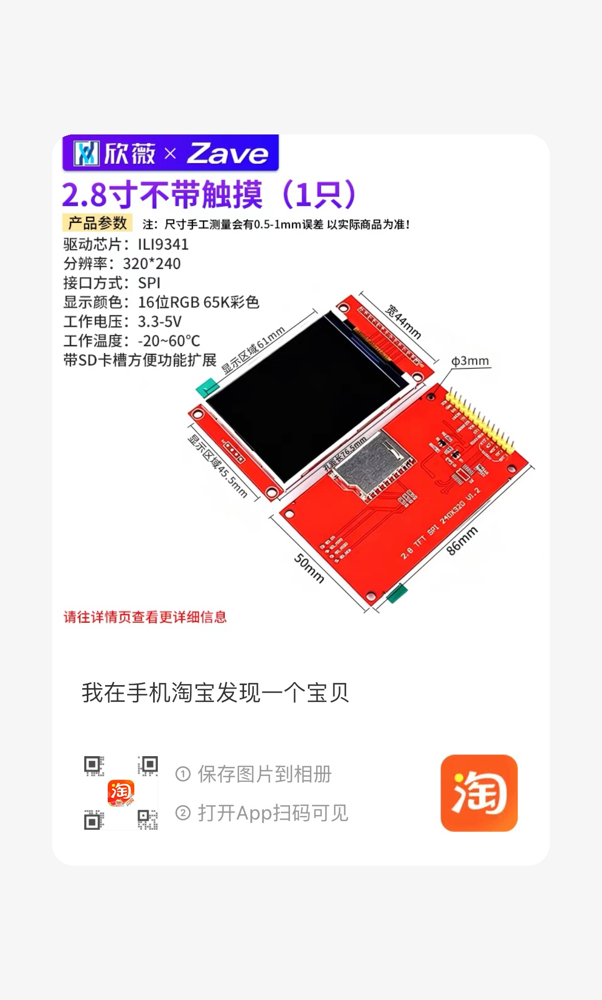
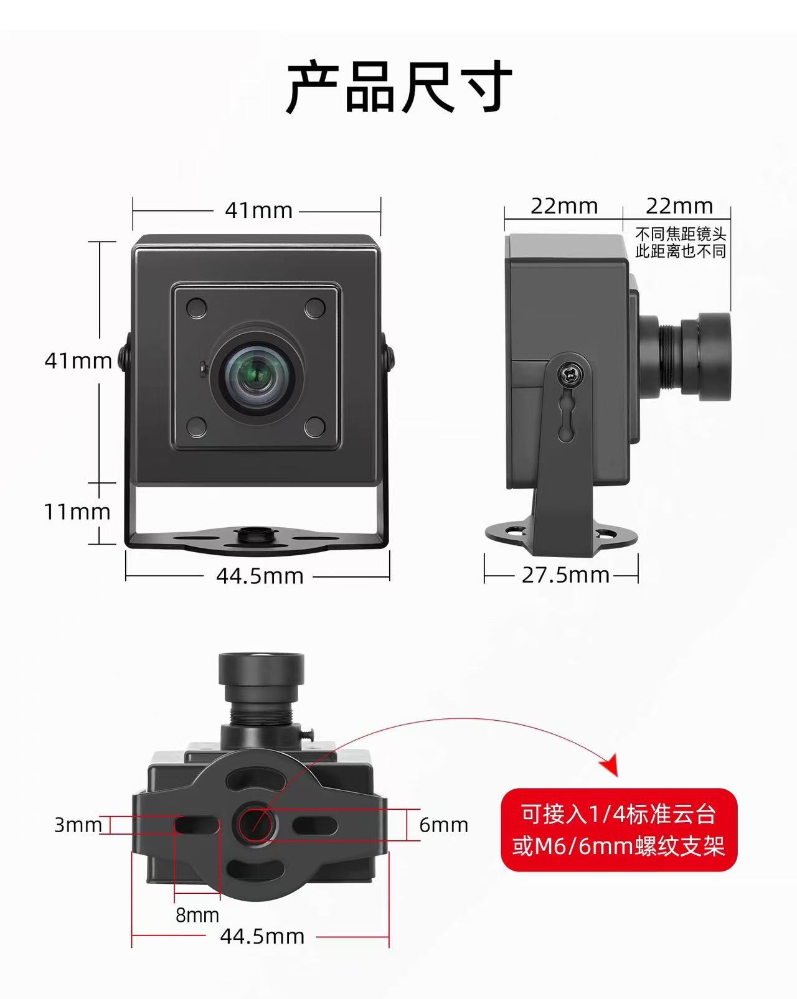
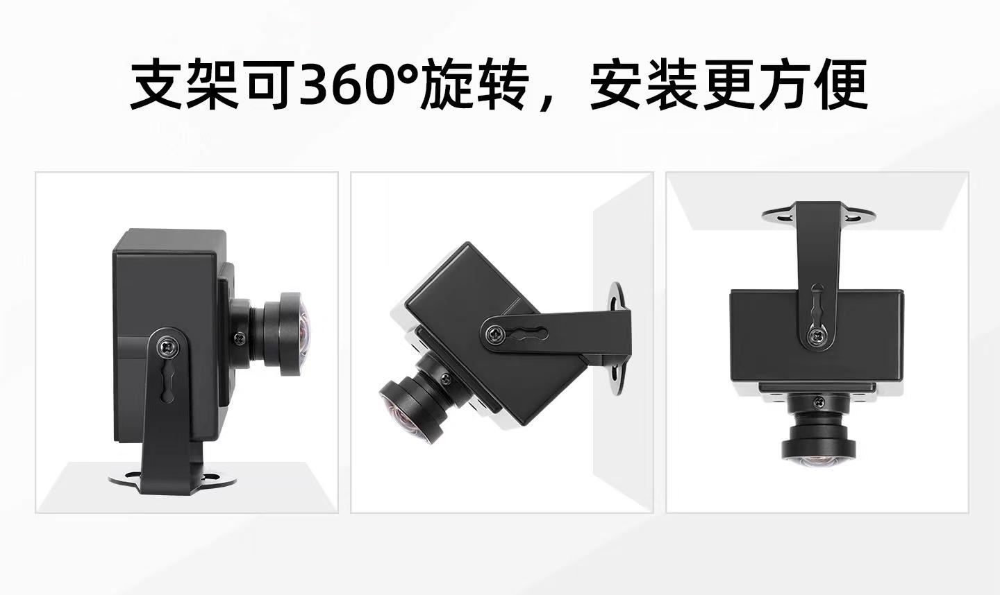

## 主要器件尺寸参数清单

1.大功率充电宝 尺寸
长150mm *宽68mm *高31mm

2.typec公对公 PD数据线 0.5ms

3.香橙派 5 plus 带亚克力保护外壳 散热风扇
   手测大概长10.5cm 宽7.1cm 高4.2cm

4.TFT彩色液晶屏模块  2.8寸

宽50mm，长86mm，孔距长边76.5mm，宽边44mm

6.ws2812b灯带 1m
只用前8颗灯珠 每两颗灯珠间隔约3.35cm，3.35*7cm，头部的引线长约12cm

7.usb3.0工业相机 

## 设计说明

现在需要设计一个3d打印的外壳来装载以上器件，其中香橙派5直接连接了，usb to ttl、usb3.0工业相机，和经典stm32f103c8t6开发板，stm32通过20cm杜邦线与usb to ttl连接，大功率充电宝通过typecPD数据线（带开关）给香橙派5 plus供电，TFT彩色液晶屏模块通过20cm杜邦线直接连到TFT彩色液晶屏模块上，ws2812b灯带，蜂鸣器模块通过20cm杜邦线连接到stm32f103c8t6开发板上。

## 设计要求
要求需要TFT彩色液晶屏模块能安装显示在外壳表面，ws2812b灯带可以安装在外壳内部，但要有孔洞让灯光能照射出来，蜂鸣器模块需要安装在外壳内部，但要有孔洞让声音能传出来，usb3.0工业相机需要安装在外壳外部，并且可以固定好，还有足够的空间来连接数据线，香橙派5 plus需要安装在外壳内部，并且有足够的空间来连接数据线，在这些要求基础上做的尽量便捷。
